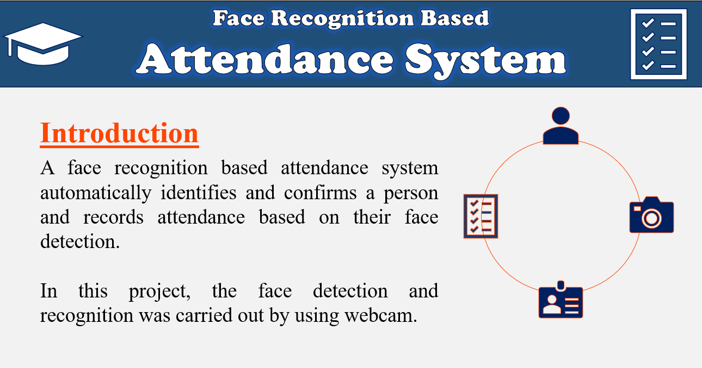
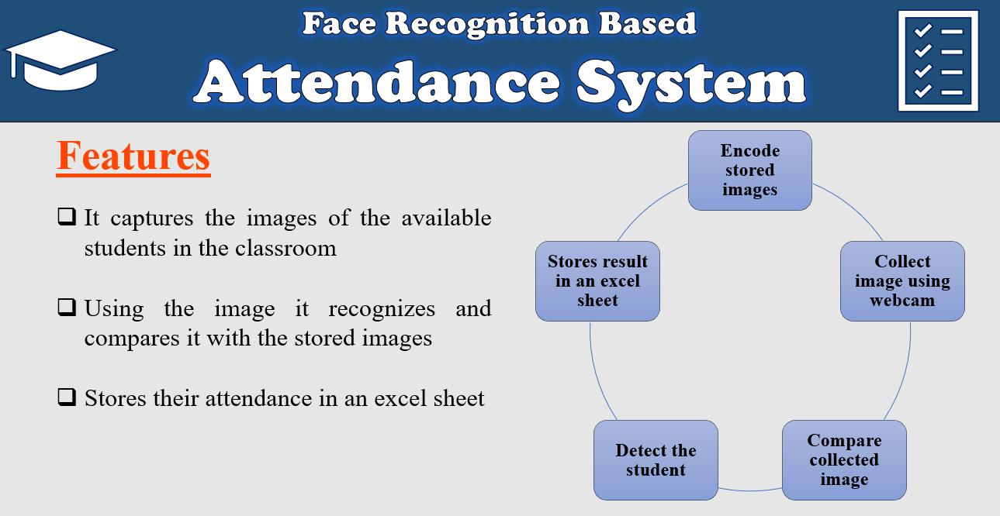
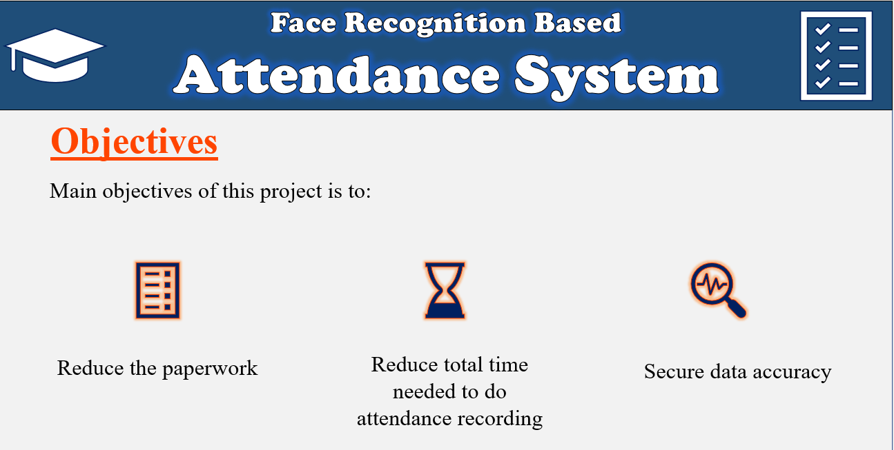
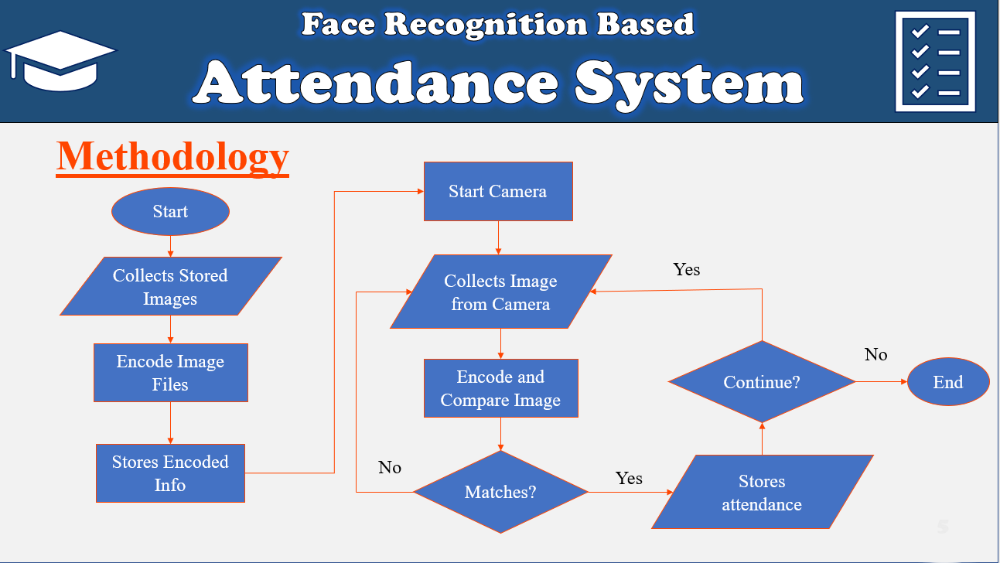
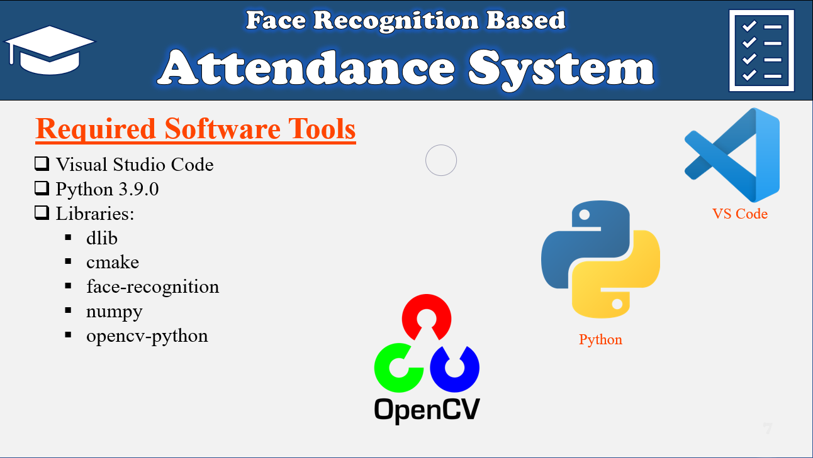

 
**References:** 
[1] Face Attendance Course by Computer Vision 
Available: https://www.computervision.zone/courses/face-attendance/ 
[ Last accessed: June 15, 2023] 

[2] Bhattacharya, S., Nainala, G.S., Das, P. and Routray, A., 2018, July. Smart attendance monitoring system (SAMS): a face recognition based attendance system for classroom environment. In 2018 IEEE 18th International Conference on Advanced Learning Technologies (ICALT) (pp. 358-360). IEEE . 
Available: https://ieeexplore.ieee.org/abstract/document/8433537/ 
[Last accessed: June 15, 2023] 
